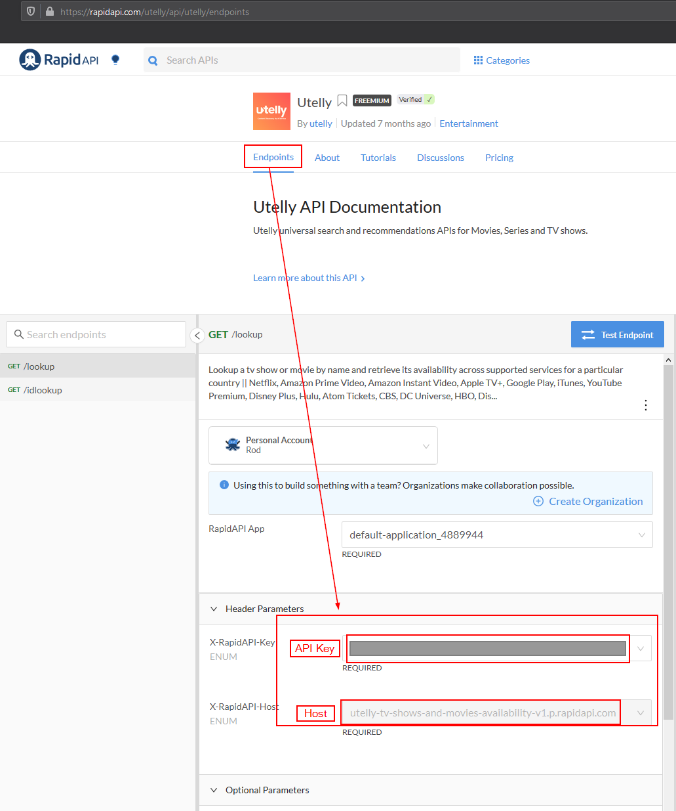

#  Video Finder
Searches streaming servics for movies or tv shows

## About
This skill searches your streaming services to find a movie or tv show. It helps you know where to go to watch something instead of having to search through all of your various services. Supported services:

    Netflix, Amazon Prime Video, Amazon Instant Video, Apple TV+, Google Play, iTunes, YouTube Premium, Disney Plus, Hulu, Atom Tickets, CBS, DC Universe, HBO, Discovery Channel, Fandango Movies, Fox, NBC, Nickelodeon, Plex

## Examples
* "Where can (i|we) (watch|stream) die hard"
  * Mycroft provides the top three results from IMDb and allows you to choose an option.
* "Where can (i|we) (watch|stream) die hard starring bruce willis"
  * Mycroft finds the top result from IMDb and automatically searches for that title.
* "Where can (i|we) (watch|stream) the bruce willis movie die hard"
  * Mycroft finds the top result from IMDb and automatically searches for that title.
* "Where can (i|we) (watch|stream) the steve carell show the office"
  * Mycroft finds the top result from IMDb and automatically searches for that title.

## Prerequisites
This skill requires an API key for IMDb and a service called "Utelly". API keys can be obtained from Rapid API.
- Utelly: https://rapidapi.com/utelly/api/utelly
- IMDB: https://rapidapi.com/apidojo/api/imdb8

A Rapid API account is free, but the IMDb and Utelly APIs are "freemium". As of 1/8/2021 you can make up to 500 API calls to IMDb and 1000 API calls to Utelly for free. More than that will cost money. Rapid API will require you to enter a credit card to obtain API keys for these services, but they only charge if you go over the limits. Privacy.com cards currently work with this service, which can limit the risk.

## Configuration
Once you have a Rapid API account setup and you have subscribed to the IMDb and Utelly APIs, you can configure this skill using https://account.mycroft.ai/skills

Visit the configuration page and first enter your API keys and host values. Also enter your country code. Streaming services offer different videos in different countries, so be sure to set the correct code here. Country codes supported by Utelly are:

    uk, us, ar, at, be, br, ca, de, es, fr, ie, id, it, in, is, kr, my, mx, no, nl, pl, pt, se, sg

Next, enter a comma-separated list of services that you want to search. Service names must match the "display_name" value in the Utelly API HTTP responses. "Plex" is an exception and must be "Plex". I've been unable to find a list of all display_name values, so you may need to experiment with the Rapid API "Test Endpoint" feature to find the correct display_name for your services. Example below:

    Netflix,Amazon Prime Video,Disney+,Plex

UTelly can search most popular video streaming services, but does not support Plex. If you want to search a Plex account, you'll have to provide Mycroft with a Plex username and password. This skill will search Plex separately after searching Utelly.

The final configuration option for CouchPotato should be disabled. This allows the video-finder-skill to talk to another skill that has not yet been published publicly.

## Credits
Rick Osgood

## Category
**Entertainment**
Media
Movies
Television

## Tags
#Netflix
#Disney plus
#Plex
#Amazon prime
#Video
#Movies
#Tv

